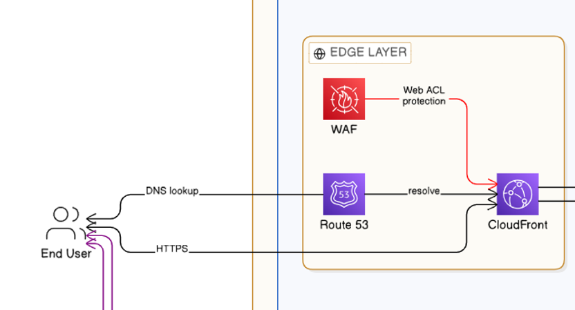
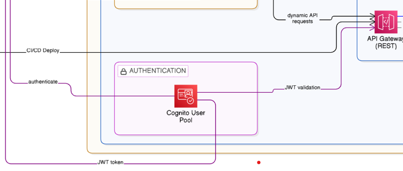
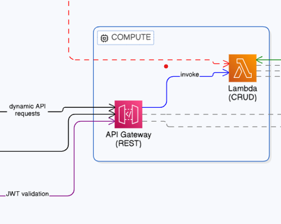
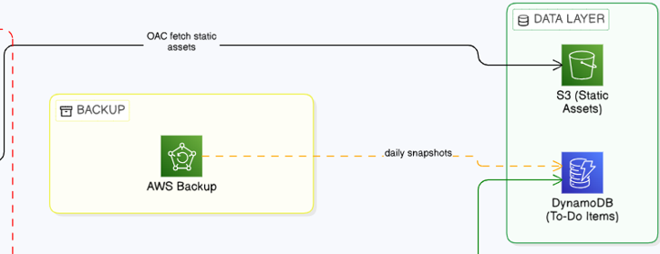
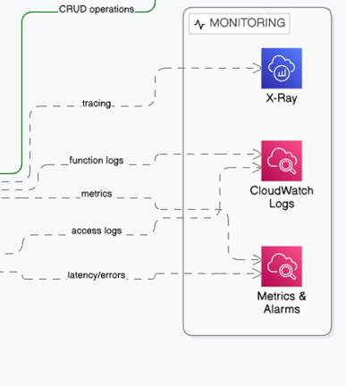
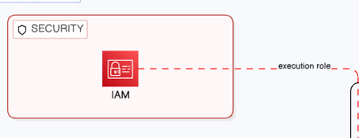

## Architecture Deep Dive

### Overview
This application follows a fully serverless, event-driven architecture 
built on AWS managed services. It eliminates the need for server 
provisioning, patching, or capacity planning. The system is organized 
into 7 logical tiers, each responsible for a specific concern.


---

### Tier 0 — Developer & Deployment
The development workflow begins on a **Developer Workstation**. Code is 
versioned and pushed to a **GitHub** repository via `git push`. From 
there, a **CI/CD pipeline** (GitHub Actions) automatically deploys 
infrastructure and application updates to AWS using AWS SAM, ensuring 
consistent and repeatable deployments.

---

### Tier 1 — Edge Layer (Orange)
Incoming user traffic is first handled at the AWS edge:

- **Route 53** resolves the application's domain name and routes traffic 
  to CloudFront via DNS lookup.
- **Amazon CloudFront** acts as the Content Delivery Network (CDN), 
  caching and delivering static frontend assets (HTML, CSS, JS) to users 
  globally with low latency over HTTPS.
- **AWS WAF** is attached to CloudFront as a Web ACL, providing 
  network-level protection against common threats including SQL injection, 
  cross-site scripting (XSS), and rate-limit abuse — before any request 
  reaches the application layer.



---

### Tier 2 — Authentication Layer (Purple)
Before accessing the API, users authenticate through:

- **Amazon Cognito User Pool** which handles user sign-up, sign-in, and 
  issues signed **JWT tokens** upon successful authentication.
- The JWT token is returned to the End User and included in all 
  subsequent API requests.
- **API Gateway** validates this JWT token via a Cognito Authorizer, 
  ensuring only authenticated users can perform CRUD operations.



---

### Tier 3 — Compute Layer (Blue)
The core application logic lives here:

- **Amazon API Gateway** (REST API) exposes 5 endpoints 
  (POST, GET, GET/{id}, PUT/{id}, DELETE/{id}), handles CORS, throttling, 
  and usage plans. It receives dynamic API requests from CloudFront and 
  forwards them to Lambda via Lambda Proxy Integration.
- **AWS Lambda** (Python 3.12) executes the business logic for each CRUD 
  operation in a stateless, serverless environment. Lambda scales 
  automatically with demand and runs across multiple Availability Zones 
  for resilience. Environment variables are used for configuration — 
  no hardcoded values.




---

### Tier 4 — Data Layer (Green)
Persistent data is managed by two storage services:

- **Amazon S3** stores the static frontend assets (HTML, CSS, JS). 
  The bucket is private with versioning enabled. CloudFront accesses it 
  exclusively via **Origin Access Control (OAC)**, ensuring the bucket 
  is never publicly exposed.
- **Amazon DynamoDB** is the NoSQL database storing all To-Do items. 
  It is configured with on-demand billing (no capacity planning needed), 
  **Point-In-Time Recovery (PITR)** for data protection, and a **Global 
  Secondary Index (GSI) on userId** for efficient query patterns. Lambda 
  interacts with it using PutItem, GetItem, UpdateItem, and DeleteItem 
  operations.




---

### Tier 5 — Monitoring & Observability (Gray)
The system is fully observable through three services:

- **Amazon CloudWatch Logs** collects two independent log streams: 
  Lambda function logs (invocations, errors, duration) and API Gateway 
  access logs (request/response details).
- **CloudWatch Metrics & Alarms** monitors key signals from both Lambda 
  and API Gateway including latency, error rates, and throttling — 
  triggering alerts when thresholds are breached.
- **AWS X-Ray** provides distributed tracing across Lambda invocations, 
  allowing full end-to-end request visibility for debugging and 
  performance analysis.




---

### Tier 6 — Security (Red)
Security is applied as a cross-cutting concern at every layer:

- **AWS IAM** enforces least-privilege access. The Lambda execution role 
  is granted only the permissions it needs: read/write to DynamoDB, 
  write to CloudWatch Logs, and send traces to X-Ray. It assumes this 
  role via `sts:AssumeRole`.
- The API is secured at two independent levels: **Cognito JWT Authorizer** 
  (user identity) and **WAF Web ACL** (network protection).
- All data in transit is encrypted via **TLS/HTTPS**. DynamoDB encrypts 
  all data at rest by default.




---

### Tier 7 — Backup & Resilience (Yellow)
- **AWS Backup** manages automated backup policies for the **DynamoDB 
  table**, taking daily snapshots with a 35-day retention period.
- **S3 resilience** is handled independently through bucket versioning, 
  preserving every version of every frontend asset.
- Lambda's **multi-AZ execution** ensures compute resilience with no 
  single point of failure.


---

### Request Flow Summary
```
End User  → Route 53 (DNS)  → CloudFront + WAF (CDN + Protection)  → Cognito (Authentication → JWT)  
    → API Gateway (REST + JWT Validation)  → Lambda (Business Logic)  → DynamoDB (Data Persistence)
      → CloudWatch + X-Ray (Observability)
```