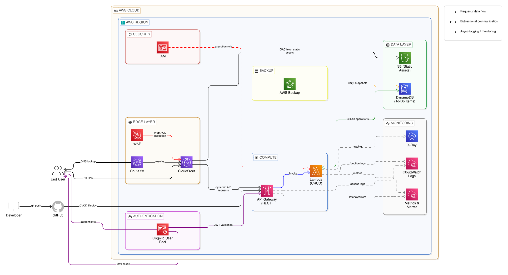

# Serverless To-Do CRUD API on AWS

## Project Overview

This project provides a complete, production-ready serverless To-Do CRUD (Create, Read, Update, Delete) API built on Amazon Web Services (AWS). It is designed to be scalable, resilient, and secure, leveraging a suite of managed AWS services to minimize operational overhead. The backend is implemented in Python 3.12, and the infrastructure is defined using the AWS Serverless Application Model (SAM).

The application includes a simple, dependency-free frontend to interact with the API, a CI/CD pipeline for automated deployments, and comprehensive security measures.

## Architecture

The architecture is fully serverless, relying on managed services to handle application logic, data storage, and request routing.



*   **User Interaction**: Users interact with the frontend application, which is hosted on Amazon S3 and delivered globally via Amazon CloudFront.
*   **API Layer**: All requests from the frontend are sent to an Amazon API Gateway REST API. AWS WAF is integrated with API Gateway to protect against common web exploits. Amazon Cognito can be integrated for user authentication and authorization.
*   **Business Logic**: API Gateway triggers the appropriate AWS Lambda function to process the request. A single Lambda handler file contains the Python code for all CRUD operations.
*   **Data Storage**: The Lambda functions interact with an Amazon DynamoDB table to store and manage the to-do items. The table is configured for on-demand billing to handle unpredictable workloads and has Point-in-Time Recovery (PITR) enabled for data protection.
*   **Monitoring & Logging**: All Lambda function invocations and API Gateway requests are logged to Amazon CloudWatch Logs for monitoring, debugging, and auditing.

## AWS Services Used

*   **Amazon API Gateway**: Provides a fully managed REST API endpoint that integrates with AWS Lambda.
*   **AWS Lambda**: Executes the application's business logic in a serverless environment.
*   **Amazon DynamoDB**: A fully managed NoSQL database for storing to-do items.
*   **Amazon S3**: Hosts the static frontend web application (HTML, CSS, JavaScript).
*   **Amazon CloudFront**: A Content Delivery Network (CDN) that securely delivers the frontend application with low latency and high transfer speeds.
*   **AWS WAF**: A web application firewall that helps protect the API from common web exploits.
*   **Amazon Cognito**: (Optional) Provides user identity and access management for securing the API.
*   **AWS IAM**: Manages access to AWS services and resources securely.
*   **Amazon CloudWatch**: Collects and tracks metrics, monitors log files, and sets alarms.
*   **AWS SAM (Serverless Application Model)**: An open-source framework for building serverless applications on AWS.

## Project Structure

```
.
├── deployment/
│   └── sam/
│       └── template.yaml      # AWS SAM template for infrastructure
├── docs/
│   ├── architecture-diagram.png # Architecture diagram
│   ├── auth.png
│   ├── compute.png
│   ├── data.png
│   ├── edge.png
│   ├── monitoring.png
│   └── sec.png
├── scripts/
│   └── deploy.sh            # Manual deployment script
├── source/
│   ├── api/
│   │   └── openapi.yaml       # OpenAPI 3.0 specification
│   ├── frontend/
│   │   ├── app.js             # Frontend JavaScript
│   │   ├── index.html         # Frontend HTML
│   │   └── style.css          # Frontend CSS
│   └── lambda/
│       └── handler.py         # Python Lambda function for CRUD operations
├── .gitignore
├── Archi.md
├── CHANGELOG.md
├── LICENSE
└── README.md
```

## API Endpoints

| Method | Endpoint          | Description                | Success Response |
|--------|-------------------|----------------------------|------------------|
| POST   | `/todos`          | Create a new to-do item    | `201 Created`    |
| GET    | `/todos`          | List all to-do items       | `200 OK`         |
| GET    | `/todos/{id}`     | Get a single to-do item    | `200 OK`         |
| PUT    | `/todos/{id}`     | Update a to-do item        | `200 OK`         |
| DELETE | `/todos/{id}`     | Delete a to-do item        | `200 OK`         |

For detailed request and response schemas, see the [openapi.yaml](source/api/openapi.yaml) file.

## Prerequisites

*   AWS Account
*   AWS CLI configured with appropriate credentials
*   AWS SAM CLI installed
*   Python 3.12
*   Docker (for local testing and building with SAM)

## Deployment Steps

### Automated Deployment (CI/CD)

1.  **Fork the repository** to your GitHub account.
2.  **Configure GitHub Secrets**:
    *   `AWS_ACCESS_KEY_ID`: Your AWS access key ID.
    *   `AWS_SECRET_ACCESS_KEY`: Your AWS secret access key.
    *   `AWS_REGION`: The AWS region for deployment (e.g., `us-east-1`).
3.  **Create an S3 bucket** in your AWS account to store the SAM deployment artifacts. Update the `deploy.yml` file with your bucket name.
4.  **Push a commit** to the `main` branch. The GitHub Actions workflow will automatically build and deploy the application.

### Manual Deployment

1.  **Clone the repository**:
    ```bash
    git clone https://github.com/your-username/serverless-todo-api.git
    cd serverless-todo-api
    ```
2.  **Run the deployment script**:
    The script will guide you through the initial deployment process.
    ```bash
    ./scripts/deploy.sh
    ```
3.  **Follow the prompts** from the SAM CLI during the first deployment. It will create a `samconfig.toml` file to store your deployment settings for future use.

## Environment Variables

The Lambda functions use the following environment variable, which is set in the `template.yaml`:

*   `TODO_TABLE`: The name of the DynamoDB table (`TodoItems`).

## Monitoring & Logging

*   **CloudWatch Logs**: All logs from the Lambda functions are sent to CloudWatch Log Groups, configured in the `template.yaml`. Log retention is set to 7 days by default.
*   **CloudWatch Metrics**: API Gateway and Lambda provide default metrics (e.g., request count, latency, error rates) that can be monitored in the CloudWatch console.
*   **X-Ray**: For more advanced tracing, AWS X-Ray can be enabled for API Gateway and Lambda to trace requests as they travel through the system.

## Security Considerations

*   **IAM Least Privilege**: The Lambda execution role is configured with the minimum required permissions (least privilege) to access DynamoDB and CloudWatch Logs only.
*   **AWS WAF**: The architecture is designed to integrate with AWS WAF to protect against common attacks like SQL injection and cross-site scripting (XSS).
*   **CORS**: Cross-Origin Resource Sharing (CORS) is enabled on the API Gateway to allow requests from the frontend domain.
*   **Data Encryption**: DynamoDB encrypts all data at rest by default. Data in transit is encrypted using TLS.
*   **Authentication**: For production use, it is highly recommended to secure the API by integrating Amazon Cognito for user authentication and authorization.

## Solution Architecture Overview

The architecture follows the AWS Well-Architected Framework across 
five pillars:

- **Operational Excellence**: CloudWatch logs + X-Ray tracing
- **Security**: IAM least privilege + WAF + Cognito JWT auth
- **Reliability**: DynamoDB PITR + S3 versioning + Multi-AZ Lambda
- **Performance**: CloudFront CDN + DynamoDB on-demand scaling
- **Cost Optimization**: Fully serverless, pay-per-use model

## License

This project is licensed under the MIT License. See the [LICENSE](LICENSE) file for details.
